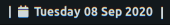
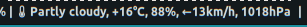
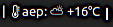

# Genmon Scripts

A couple of Bash scripts I use to add information onto the XFCE Panel, using the [Genmon Plugin](https://docs.xfce.org/panel-plugins/xfce4-genmon-plugin).  
The idea is to have that information available and visible all the time, no need to press a keyboard combo, nor open a window, type any key nor minimize any window to be able to see the information provided by these scripts thru Genmon.

## genMon-time.sh 

Prints the local time, using a specific format: "17:23". Also, the script disables any form of tooltip when mouse over it, as I find that particularly annoying.

## genMon-load.sh 

Prints the first value of the CPU load average, also a FontAwesome icon right before the load info.

## genMon-RAM.sh 

Prints the percentage of RAM been used, also a FontAwesome icon right before the RAM percentage.

## genMon-date.sh 

Prints the date on a specific format, also when clicked, it pops a calendar with the current month displayed.

## genMon-bsas-weather.sh 

## genMon-cpu-temp.sh

Prints the temperature of the CPU.

